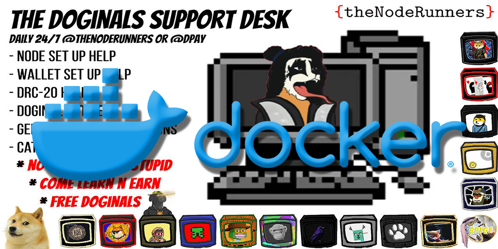

# NODE RUNNER Dogecoin Node Docker Setup - Currently Updating Container. Check back for Updates.



## Overview

This setup provides a Docker container that installs and configures a Dogecoin node, along with several utilities, and resumes installation even after a system restart. The container will detect the operating system and install the Dogecoin node accordingly.

## Prerequisites

- Docker
- Docker Compose
- Visual Studio Code

### What is Docker?

Docker is a tool designed to make it easier to create, deploy, and run applications by using containers. Containers allow a developer to package up an application with all parts it needs, such as libraries and other dependencies, and ship it all out as one package.

### What is Docker Compose?

Docker Compose is a tool for defining and running multi-container Docker applications. With Compose, you use a YAML file to configure your application's services. Then, with a single command, you create and start all the services from your configuration.

## Instructions

### Step 1: Install Docker and Docker Compose

#### For Windows:

1. Download Docker Desktop from [Docker's official website](https://www.docker.com/products/docker-desktop).
2. Follow the installation instructions for your operating system.
3. Once installed, Docker and Docker Compose come bundled together.

### Step 2: Open Visual Studio Code

1. Download and install Visual Studio Code from [Visual Studio Code's official website](https://code.visualstudio.com/).
2. Open Visual Studio Code.

### Step 3: Clone the Repository

In Visual Studio Code, open a new terminal and run the following commands to clone the repository containing the Docker setup files:

```sh
git clone https://github.com/booktoshi/NodeRunner-Windows-Docker-UC.git
cd NodeRunner-Windows-Docker---UC
```

### Step 4: Build the Docker Image

To build the Docker image, run the following command in the terminal:

```sh
docker build -t dogecoin-node .
```

### Step 5: Run the Docker Container

To start the Docker container, run the following command in the terminal:

```sh
docker-compose up -d
```

### Step 6: Verify Dogecoin Node Status

To check the status of the Dogecoin node, run the following command in the terminal:

```sh
docker exec -it dogecoin_node dogecoin-cli getblockchaininfo
```

## Utilities Included

The following utilities are included and cloned into the doginals directory:

- APE DUNES GUI
- APE Image Converter
- BC Auto Scripts
- BC Snapshot
- BCxHeim Recurse
- BP MetaData Merger
- BP TelegramBot
- SirDuney DUNES

## Resuming Installation

If the Docker container is stopped or the system is restarted, the installation can be resumed by starting the container again:

```sh
docker-compose up -d
```

The state management script will ensure that the Dogecoin node starts and the installation resumes as needed.

## Troubleshooting

If you encounter any issues, check the logs for more details:

```sh
docker logs dogecoin_node
```

For further assistance, consult the documentation for Docker and Docker Compose.

This setup ensures a smooth installation and configuration of a Dogecoin node with additional utilities, while handling system restarts gracefully.
